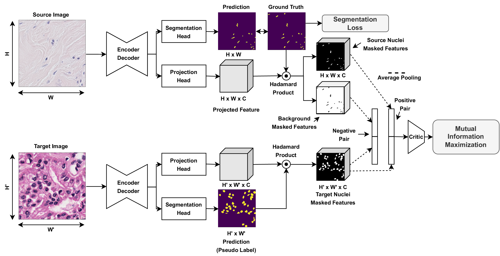

# MaNi

## Introduction

Implementation of MaNi: Maximizing Mutual Information for Nuclei Cross-Domain Unsupervised Segmentation. In this work, we made following contributions: 
- Proposed a simple Jensen-Shannon Divergence-based contrastive loss for Unsupervised Domain Adaptation in nuclei semantic and instance segmentation tasks. 
- Our proposed loss maximizes the mutual information between the representations of ground truth nuclei pixels from the labeled source dataset and the pseudo-labeled nuclei pixels in the target data.
- Demonstrated our approach using different architectures and for over 20 cancer-type domain shifts establishing that the inclusion of the MI loss leads to competitive gain over recently proposed methods. 
    

    

    
    
## Abstract

In this work, we propose a mutual information (MI) based unsupervised domain adaptation (UDA) method for the cross-domain nuclei segmentation. Nuclei vary substantially in structure and appearances across different cancer types, leading to a drop in performance of deep learning models when trained on one cancer type and tested on another. This domain shift becomes even more critical as accurate segmentation and quantification of nuclei is an essential histopathology task for the diagnosis/ prognosis of patients and annotating nuclei at the pixel level for new cancer types demands extensive effort by medical experts. To address this problem, we maximize the MI between labeled source cancer type data and unlabeled target cancer type data for transferring nuclei segmentation knowledge across domains. We use the Jensen-Shanon divergence bound, requiring only one negative pair per positive pair for MI maximization. We evaluate our set-up for multiple modeling frameworks and on different datasets comprising of over 20 cancer-type domain shifts and demonstrate competitive performance. All the recently proposed approaches consist of multiple components for improving the domain adaptation, whereas our proposed module is light and can be easily incorporated into other methods.

## How to Use

- Update load_data.py to include file paths. 
- Use orchestrator.py for running the code. Use proto_w tag for including and adjusting the MI loss weight and domain_w tag for including and adjusting gradient reversal weight.

## Reference

The paper has been provisionally accepted at MICCAI2022. The full pdf will be soon included.
